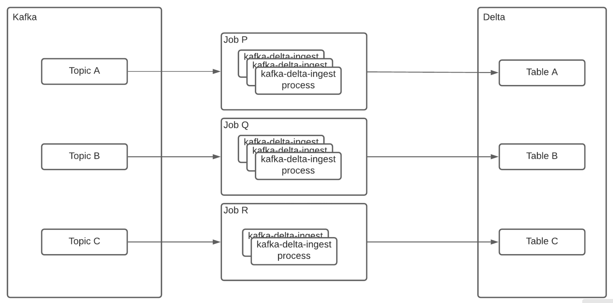
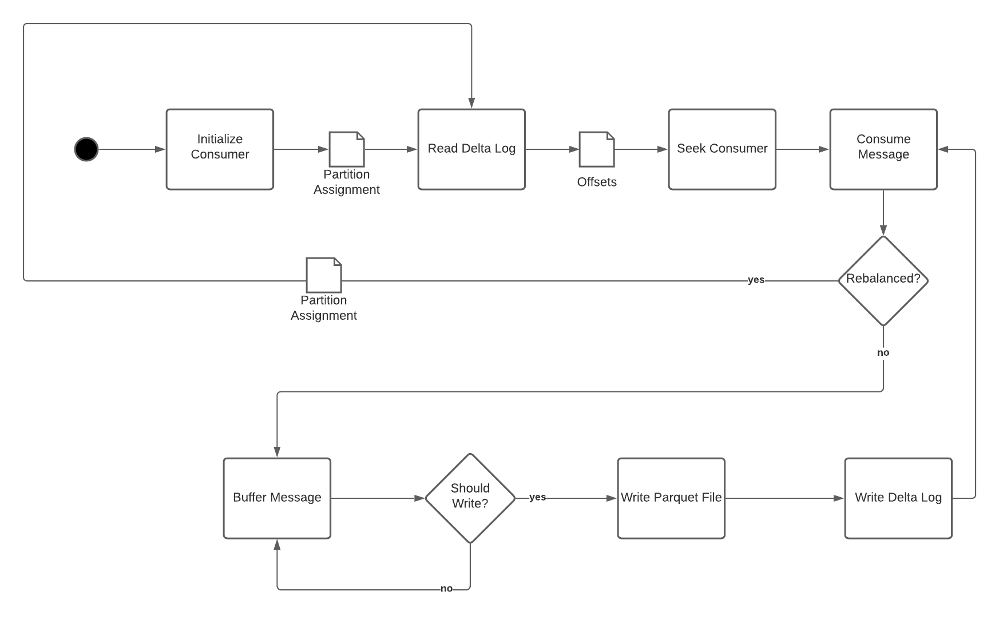

## Summary

This document describes the design of the kafka-delta-ingest service. The purpose of kafka-delta-ingest is to consume messages from Kafka topics, perform a few standard transformations (primarily for deriving a date-based partition column and merging service metadata) and append them to delta lake tables.

Application code shall be implemented in Rust to achieve a high level of efficiency. 

Only JSON Kafka message formats will be supported in the initial implementation. Databricks Spark clusters must be able to read from delta tables written to by kafka-delta-ingest as though they were written by a Spark writer.

## Architecture

This document uses the term "job" to represent the full set of running kafka-delta-ingest resources required to sync a single Kafka topic to a Delta table. The term "process" is used to represent a single running resource that is part of a job. The relationship from topic-to-process is 1:M (to accommodate scalability and efficient resource allocation for both low-volume and high-volume topics), so a topic may have one or more processes handling it, but a single process will only handle a single topic. The relationship from job-to-process is 1:M, and the relationship from job-to-topic is 1:1.

### Process Parameters

Basic required process properties (i.e. parameters with no default) must include:

* app_id
    * unique per topic per environment
    * must be the same for all processes that are part of a single job
* topic name
    * must be the same for all processes that are part of a single job
* table path
    * must be the same for all processes that are part of a single job

Properties with overrides include:

* consumer_group_id
    * default is kafka_delta_ingest
    * must be the same for all processes that are part of a single job

Properties for which overrides will not be expected or supported in v1 include:

* compression type (always snappy)

Figure 1 shows an example of some jobs and their composing processes handling a few different Kafka topic to Delta table streams.

_Figure 1_

Each kafka-delta-ingest job is fully distributed with no coordinator process. Processes will coordinate on delta writes using optimistic concurrency. 

---

## Application Design

The design invariants listed below describe the guidelines considered for the design:

* To support read efficiency, Kafka messages must be buffered into sizable record batches before they are written
* Parquet file sizes should be as large as possible to limit optimization latency and pre-optimized query latency.
* Messages should be transformable (pure message transformation only - no joins or aggregates) prior to delta table write.
* Clients should be capable of specifying their allowed message latency for specific jobs, and actual message latency should approximate this value.
    * We will assume “processing time == 0” and use allowed latency as a flush marker.

The goals of achieving optimal size for low read latency and low write latency are in sharp contrast, so allowing for knobs and dials (i.e. configuration parameters) to tune this equation while simultaneously limiting code complexity is a key design factor.

Key options that should be provided as program arguments include:

* allowed_latency - max desired latency from when a message is received to when it is written and committed to the target delta table (in seconds). Note that this property is a guideline used internally for controlling frequency of flushes to delta and is not intended as a latency guarantee. The actual latency from the time a message is sent to the Kafka topic and becomes queryable from Delta Lake will exceed this value by the processing time.
* max_messages_per_batch - number of messages to buffer before writing a record batch. This should be set to some number n of messages m, where approximate_compressed_parquet_size  `n * m  ~= min_bytes_per_file`. Benchmarking should be performed by the user to find the right value that most closely matches min_bytes_per_file. Since the number of bytes that will be written in each parquet file cannot be known prior to writing the compressed parquet bytes to a memory buffer, this option is used to approximate min_bytes_per_file for each RecordBatch based on what benchmarking indicates is appropriate on average. This means that, unless allowed_latency is reached, the actual bytes per parquet file should usually be ~= twice the value of min_bytes_per_file.
* min_bytes_per_file - desired minimum number of compressed parquet bytes to buffer in memory before writing to storage and committing a transaction. Note that this property is trumped by allowed_latency. If allowed latency is reached before min_bytes_per_file, file size will correspond to the number of bytes received in the allowed latency interval.

The primary run loop of kafka-delta-ingest should follow the pseudo-code outline described below:

* Create an rdkafka StreamConsumer for the Kafka topic with the configured consumer group id.
* Check assigned partitions and store them internally.
* Register rebalance handler with ConsumerContext.
* Handle each message from the topic in a loop.
* Invoke a transformation function for each received message.
    * This allows the client context to modify the Kafka message and mutate it before it is written to Delta.
* Buffer each transformed message along with its partition and offset until either options.allowed_latency or options.max_messages_per_batch is reached.
* When either options.allowed_latency or options.max_messages_per_batch is reached, write a record batch to the underlying writer. 
    * If options.allowed_latency is reached, complete the underlying writer, commit the Delta transaction, and commit Kafka offsets.
    * If options.allowed_latency is NOT MET, but options.message_buffer_length is, continue to hold the writer open so additional batches may be written to the same file.
* After each record batch write, check current number of buffered messages. If this meets or exceeds options.min_bytes_per_file, complete the underlying writer, and write the buffer bytes to S3, and execute an end-to-end transaction (See “End-to-end Transactions / KafkaOffsetHandling”).

When creating DeltaTransactions - these shall be created with a StreamingUpdate operation in [CommitInfo](https://github.com/delta-io/delta/blob/master/PROTOCOL.md#commit-provenance-information). See [StreamingUpdate](https://github.com/delta-io/delta/blob/7899c47dd6594128d80db341bcb8d89ef62a9b78/src/main/scala/org/apache/spark/sql/delta/DeltaOperations.scala#L70) in the reference implementation.

### Key Dependencies

This section lists the crate repositories that are most important to the total job of kafka-delta-ingest.

* [delta-rs](https://github.com/delta-io/delta-rs)
* [arrow](https://github.com/apache/arrow/tree/master/rust/arrow)
* [parquet](https://github.com/apache/arrow/tree/master/rust/parquet)
* [rdkafka](https://github.com/fede1024/rust-rdkafka)
* [dipstick](https://github.com/fralalonde/dipstick)
* [tokio](https://github.com/tokio-rs/tokio)

### End-to-end Transactions / Kafka Offset Handling

This section describes how end-to-end transactions that account for Kafka partition offsets should be committed in a way that prevents duplication from re-processing of already written messages.

On startup and after rebalance, each kafka-delta-ingest process must check its assigned partitions and re-seek the consumer when necessary. Each process must maintain an internal map of assigned partitions and current offsets.  Kafka’s group management protocol guarantees that individual consumers within a group will be assigned a mutually exclusive set of partitions at any given time.

Upon startup or partition assignment (in case of rebalnce), to identify the last offset written to Delta Lake for each assigned partition, the kafka-delta-ingest process must locate the last txn action in the delta log for each of its assigned partitions and re-seek the consumer based on the txn.version attribute of the delta log. 

When performing a write, each process must commit the last offset of each partition within a txn action contained in the delta log entry.

Figure 2 shows a workflow diagram of these steps. 

_Figure 2_

